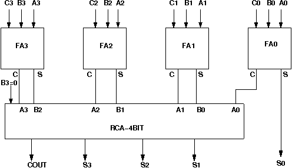

# Procedure

## Assignment Statements :
You are required to build the following Wallace tree adders

- Adder to add seven bits
- Adder to add three 4-bit numbers
- Adder to add five 4-bit numbers
- Adder to add seven 4-bit numbers

## Circuit diagram of Wallace Tree Adder:

## Follow the below manual and perform the experiment

- Manual --> [Click Here](./simulation/coavlNew.pdf)

<embed src="./simulation/coavlNew.pdf" type="application/pdf">

