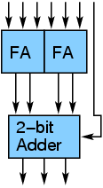
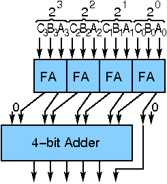
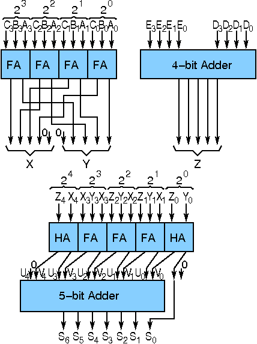

# Theory:

## Design of Wallace Tree Adders :

There are many cases where it is desired to add more than two numbers together. The straightforward way of adding together m numbers (all n bits wide) is to add the first two, then add that sum to the next using cascading full adders. This requires a total of m − 1 additions, for a total gate delay of O(m lg n) (assuming lookahead carry adders). Instead, a tree of adders can be formed, taking only O(lg m · lg n) gate delays.

A Wallace tree adder adds together n bits to produce a sum of log2n bits.

The design of a Wallace tree adder to add seven bits (W7) is illustrated below:

An adder tree to add three 4-bit numbers is shown below:

An adder tree (interconnections incomplete) to add five 4-bit numbers is shown below:

The above block diagrams can be used to design different wallace tree adder.